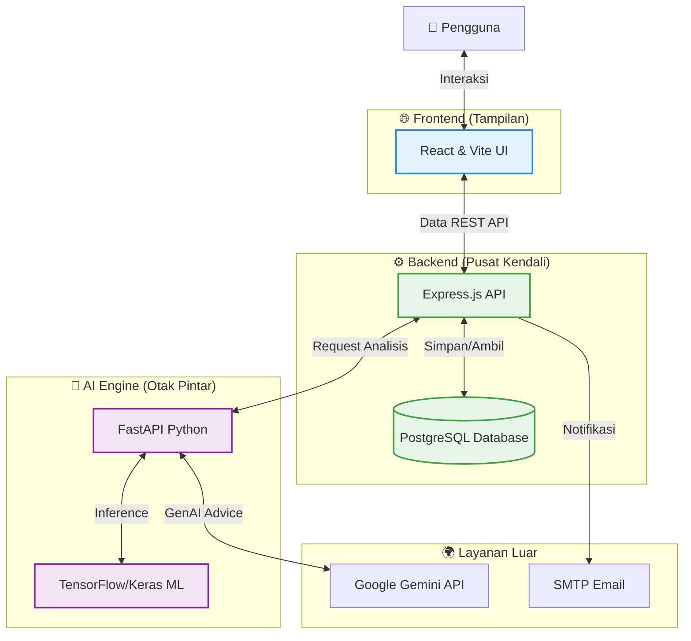

# 🏛️ CakapKarier-AI: Arsitektur Sistem & Tech Stack

Project ini menggunakan arsitektur **Microservices modern** yang memisahkan antara antarmuka pengguna, pusat kendali bisnis, dan mesin kecerdasan buatan untuk performa maksimal.

---

## 📊 Visualisasi Arsitektur

Diagram di bawah ini menunjukkan komponen utama sistem dan bagaimana mereka saling terhubung:

---

## 💻 Ringkasan Tech Stack

Kami menggunakan teknologi pilihan yang teruji untuk memastikan sistem yang cepat, aman, dan cerdas:

### 1. Frontend (User Interface)
*   **React 19 & Vite**: Menghasilkan website yang sangat cepat diakses dan interaktif.
*   **TailwindCSS**: Desain modern dan responsif di berbagai perangkat (Mobile/Desktop).

### 2. Backend (Pusat Data)
*   **Express.js**: Engine yang efisien untuk menangani trafik data dan keamanan pengguna.
*   **PostgreSQL**: Database tangguh untuk menyimpan data profil dan riwayat analisis dengan aman.

### 3. AI Engine (Kecerdasan Buatan)
*   **Python & FastAPI**: Standar industri untuk menjalankan layanan kecerdasan buatan.
*   **TensorFlow/Keras**: Mesin utama untuk memprediksi kecocokan karier berdasarkan data.
*   **Google Gemini API**: Memberikan saran karier yang cerdas dan personal bagi setiap pengguna.

### 4. Infrastruktur
*   **Docker & Docker Compose**: Memastikan aplikasi berjalan stabil di server manapun.
*   **NPM Workspaces**: Manajemen project yang rapi dalam satu tempat (Monorepo).

---

## 💡 Mengapa Arsitektur Ini Unggul?
1.  **Cepat**: Pemisahan tugas membuat website tetap ringan meskipun sedang melakukan perhitungan AI yang berat.
2.  **Aman**: Menggunakan enkripsi standar industri untuk menjaga privasi data pengguna.
3.  **Skalabel**: Sistem ini siap untuk menangani peningkatan jumlah pengguna di masa depan dengan mudah.
